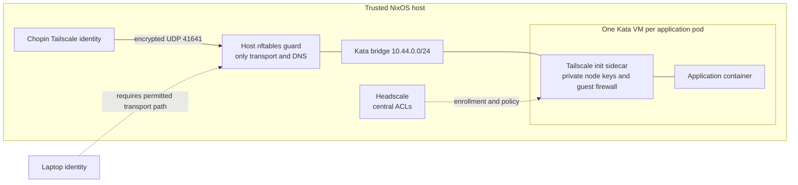

# Chopin: declarative Kata pods with Tailscale sidecars

Chopin (`192.168.1.82`, SSH user `rocheque`) runs single-node K3s on NixOS.
This configuration replaces Calico with ordinary CNI networking and a small
host transport guard. Headscale defines application permissions. Headscale
uses **HTTP on the local network**, as requested; this is not a public remote
access deployment.

## Rebuild

```sh
sudo nixos-rebuild switch --flake path:/home/rocheque/homelab#chopin
sudo systemctl status k3s headscale chopin-network-guard chopin-sidecar-image
sudo systemctl status chopin-retire-calico chopin-tailnet-enrollment.timer
sudo k3s kubectl get nodes,pods -A -o wide
sudo headscale nodes list
```

The flake pins Nixpkgs, K3s, Headscale and Tailscale. Kata 4.2.0 is a
checksum-pinned static bundle. No manual `tailscale up`, Kubernetes Secret,
container-image import or namespace setup is needed on Chopin:

- Nix installs the runtime, CNI configuration, host guard and system services.
- K3s applies the RuntimeClass, admission policies, application namespaces,
  default service accounts and example HTTP deployment from Nix manifests.
- Nix builds a content-addressed sidecar image and imports it into containerd.
- The enrollment service creates Headscale users, enrolls Chopin, and writes
  namespace-specific enrollment Secrets through the local root-only API.
- A timer renews reusable, ephemeral enrollment keys every 12 hours. Keys
  expire after 24 hours. Their Headscale owner can request only that
  namespace's declared group; application credentials never belong to the
  laptop administrator.
- The idempotent migration service retires the previous Calico manifests,
  moves existing system pods onto Flannel, and removes Calico's active agents,
  transport configuration and firewall rules. Known old CRDs and stored
  Calico data remain inert for recovery; they are not a policy engine.

Chopin's wired profile is declared with `192.168.1.82/24`, gateway/DNS
`192.168.1.254`, on `enp1s0f1`. Reserve that address on the router to avoid
another DHCP client receiving it. NetworkManager leaves runtime-created
Kubernetes and Tailscale interfaces, and the two unused Ethernet ports, unmanaged.

Configuration is reproducible; persistent data and private keys are not Git
configuration. Back up `/var/lib/headscale`, `/var/lib/tailscale`,
`/var/lib/rancher/k3s`, and application storage. A fresh installation generates
new server keys and workload identities. Existing laptop registrations need
that state restored, or must be enrolled again. The existing NixOS account,
disk layout and OS hostname are preserved. `ssh/rocheque.pub` declares this
PC's public key for SSH access on a fresh installation; no private key is in
the repository. The account's current password is runtime state, not a
password committed to this repository.

## Traffic and trust boundaries



System pods use Flannel (`10.42.0.0/24` on this node); Kata's containerd handler
uses a separate bridge CNI (`10.44.0.0/24`, without masquerading). Kata hands
the CNI attachment into the VM as an ordinary `eth0`. The sidecar creates
`tun`/`tailscale0` **inside the guest**. Privileged guest containers are not
given host devices. All non-infrastructure pods must use `kata-qemu`, and get
an injected, restartable Tailscale init sidecar before the app starts.

The host guard checks ingress interface, so spoofing a system pod's source IP
does not turn a Kata guest into an infrastructure pod. It covers routed IPv4,
IPv6 and same-bridge forwarding. It permits enrollment to Chopin TCP 8080,
Tailscale UDP 41641 to the local host/other Kata guests, and TCP/UDP 53 to the
system pod subnet. Other direct guest traffic is dropped. ARP is allowed for
transport discovery; this is not complete protection against layer-2 denial
of service. A permitted UDP port alone does not authenticate a packet;
Tailscale's receiving daemon performs cryptographic authentication and ACL
checks.

The guest firewall accepts loopback, `tailscale0`, encrypted UDP transport and
established replies. Ordinary pod and Service IPs do **not** provide application
access. The host is trusted and can administer guests with exec/port-forward.
Guest root can modify its guest firewall, read its own Tailscale credentials,
and move that identity elsewhere. It cannot edit the host guard through the
virtual NIC. This design does not keep keys outside the VM or bind them to a
physical location. Virtualization reduces risk; guest escape remains possible
through vulnerabilities in KVM, QEMU, Kata or the host.

This also differs from independent AWS-style ingress **and egress** enforcement.
In the pinned [Tailscale filter implementation](https://github.com/tailscale/tailscale/blob/v1.98.10/wgengine/filter/filter.go),
ACL matching occurs on receive; normal outbound packets are accepted by
`runOut`. A compromised destination can replace its own daemon/filter and
accept traffic beyond its assigned ingress rules. Healthy receiving peers
still protect themselves. The host guard blocks ordinary-network bypass,
but cannot inspect encrypted application ports. Full enforcement outside
both source and destination VMs requires host-side identities/filtering or
another external policy engine; this chosen guest-sidecar design does not
provide that stronger guarantee.

Keep namespaces, admission configuration, RuntimeClasses, Headscale policy,
Secrets with privileged credentials, and `kube-system` under administrator
control. Pod labels and annotations do not select Headscale groups. Application
containers remain non-root with no privilege escalation and dropped
capabilities; only the fixed sidecar may be privileged. The native mutation
API is **beta** in Kubernetes 1.35 and explicitly enabled. No custom webhook,
Tailscale hosted API, OAuth or custom CNI binary is used.

## Application permissions and namespaces

Edit `tailscale/policy.json` and rebuild. Unlisted connections are denied.
The example policy lets `tag:laptop` reach applications on TCP 8080 and 5432,
and lets Chopin reach TCP 8080 for administration. It does not grant access to
Chopin or internet egress. Remove or narrow the example ports for real apps.

Declare groups in Nix, for example in `configuration.nix`:

```nix
homelab.tailnet.namespaceTags = {
  applications = "tag:applications";
  default = "tag:default";
  frontend = "tag:frontend";
  database = "tag:database";
};
```

Matching namespaces, Headscale users, tag ownership and rotating enrollment
Secrets are generated automatically. Add a central ACL entry such as:

```json
{"action":"accept","proto":"tcp","src":["tag:frontend"],"dst":["tag:database:5432"]}
```

Declare applications with `services.k3s.manifests` as shown by
`30-example-web` in `kubernetes.nix`. Set `runtimeClassName: kata-qemu` and use
the security context in `examples/application.yaml`; no sidecar is needed in
your application manifest. Pods in unregistered namespaces cannot enroll.
Application users must not be allowed to edit administrator-owned enrollment
Secrets or place workloads in infrastructure namespaces.

Each new pod has a separate node key, even when its policy group is shared.
An `emptyDir` preserves state across a sidecar restart; replacing/rescheduling
the pod creates a new identity. Disconnected ephemeral identities are removed
after approximately five minutes. A stolen identity kept online may remain
active; revoking an enrollment key alone does not revoke already enrolled
nodes. Revoke nodes explicitly with `headscale nodes delete --identifier ID`.

Include `config.homelab.tailnet.sidecarRevision` in Nix-managed workload
**template annotations** so changing the injected image triggers the normal
controller rollout. The declarative demo already does this. Mutation runs on
creation; it does not retrofit running pods. Raw manifests without a revision
annotation require an explicit rollout after sidecar changes. Existing pods
keep their current VM until replacement.

## Services, DNS and laptop access

The demo is declared in Nix, listens on TCP 8080, and is reachable from Chopin
through its Tailscale address:

```sh
pod=$(sudo k3s kubectl -n applications get pod -l app=web -o jsonpath='{.items[0].metadata.name}')
address=$(sudo k3s kubectl -n applications exec "$pod" -c tailscale -- tailscale ip -4)
curl "http://$address:8080"
```

Kubernetes DNS works through CoreDNS. This includes external DNS resolution,
which can itself be an information egress channel; packet filtering does not
prevent DNS tunneling. No direct guest internet access is granted. Headscale
MagicDNS is advertised to DNS-enabled tailnet clients; application pods keep
Kubernetes DNS (`--accept-dns=false`). Their normal resolver does not yet
provide MagicDNS. Use Tailscale addresses or add deliberate DNS integration
before deploying applications that need stable tailnet names.

Ordinary Kubernetes ClusterIP Services, ingress controllers and node HTTP/TCP
health probes do not transparently traverse per-pod Tailscale identities. Use
exec probes and tailnet endpoints. The demo Service is for administrator
port-forwarding; it is not an application-policy bypass. Stable discovery and
load balancing across recreated per-pod identities need additional integration.

Laptop enrollment is intentionally separate: create a one-use key for the
`admin` Headscale user with `tag:laptop`, and configure the laptop client to
use `http://192.168.1.82:8080`. Do not place that key in application namespaces
or Git. **The current transport guard only permits the local Chopin/guest
paths; arbitrary laptop or offsite endpoints are not yet allowed.** Add a
known local peer transport endpoint declaratively, or configure an
administrator-controlled relay/gateway for offsite access. Merely enrolling
a laptop does not make those paths work.

The advertised public relays are deliberately unreachable from guests, so
Tailscale may report relay health warnings. Local UDP discovery can delay a
first connection; short connect timeouts can fail before a direct path is
established. This interim setup has no usable relay fallback.

No TLS, public control URL, public relay or router changes are installed.
HTTP provides no certificate-authenticated control-server identity; do not
expose it publicly or treat this phase as protection against every network
MITM. Tailscale control uses Noise and payload traffic is encrypted, but those
facts do not replace a trustworthy enrollment endpoint. Remote access and
optional internet through an exit node remain explicit follow-up work.

## Availability and operational limits

If Headscale is down, existing clients retain their cached maps/policy and
can communicate while usable endpoints/keys remain. New connections to known
peers can work; unknown peers, new identities and policy revocations cannot
be distributed. Existing enforcement does not become allow-all. New pods wait
in their sidecar startup phase. If a sidecar/VM dies, that workload loses its
Tailscale path; the host guard still blocks direct bypass. A host/root failure
is outside the threat model.

The transport bridge has MTU 1500; Tailscale uses its normal smaller tunnel
MTU. Encryption runs in each VM, with an additional VM and Tailscale process
per pod. No throughput or scale benchmark was performed. This configuration
is **single-node**: host-local Kata IPAM, DNS infrastructure ranges and peer
transport rules must be redesigned before adding nodes. Cross-node behavior,
root-guest impersonation resistance, policy-revocation timing, restart and
rescheduling are not claimed as comprehensively tested.

Useful diagnostics:

```sh
sudo journalctl -u k3s -u headscale -u chopin-tailnet-enrollment
sudo k3s kubectl -n applications logs deployment/web -c tailscale
sudo nft list table inet chopin_kata_guard
sudo nft list table bridge chopin_kata_guard
sudo tailscale status
sudo k3s kubectl -n applications exec deployment/web -c tailscale -- tailscale status
```

`verify-isolation.sh` provides optional smoke checks. The live deployment
verified a real Kata virtual NIC and sidecar enrollment, allowed overlay HTTP,
blocked unlisted overlay ports and ordinary pod-address HTTP,
Kubernetes DNS, Flannel system-pod migration and preserved SSH. These are
operational checks, not a proof of the full adversarial threat model.

## Pinned implementation references

The locked Nixpkgs revision is
[`7fc6f2c20af09cdcaf48b92ec3121860139ec668`](https://github.com/NixOS/nixpkgs/tree/7fc6f2c20af09cdcaf48b92ec3121860139ec668).
It supplies K3s 1.35.8, [Headscale 0.28.0](https://github.com/juanfont/headscale/tree/v0.28.0)
and [Tailscale 1.98.10](https://github.com/tailscale/tailscale/tree/v1.98.10).
The [Kata 4.2.0 bundle](https://github.com/kata-containers/kata-containers/releases/tag/4.2.0)
is pinned separately in `kata.nix`. Tailscale and Headscale are BSD-3-Clause;
Kata, Kubernetes and containerd use Apache-2.0.

Containerd's [per-runtime CNI and privileged-device configuration](https://github.com/containerd/containerd/blob/v2.2.7/docs/cri/config.md)
provides the external attachment without a new CNI implementation.
Kubernetes's [native mutation documentation](https://kubernetes.io/docs/reference/access-authn-authz/mutating-admission-policy/)
and the [1.35 feature-gate definitions](https://github.com/kubernetes/kubernetes/blob/v1.35.8/pkg/features/kube_features.go)
explain the explicitly enabled beta API. The sidecar arrangement follows
[Tailscale's documented pod sidecar integration](https://tailscale.com/docs/solutions/connect-kubernetes-pods-to-tailnet-using-sidecar),
with local Headscale enrollment and host bypass prevention added here.
